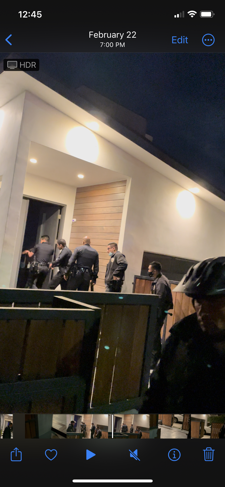

# What it's like to live at 616 N Fuller Ave, Los Angeles CA 90024

I lived at this house for a year. There were some amazing moments, and some terrible ones. Here's what you can expect from the propery that won't come through with a tour or the [Zillow listing](https://www.zillow.com/homedetails/616-N-Fuller-Ave-Los-Angeles-CA-90036/20785361_zpid/):

# Danger: SWAT teams will be called to your home

[Offline TV](https://en.wikipedia.org/wiki/OfflineTV), one of the most popular youtube streaming collectives in the world, used to live at the house and make content. With over 10 million followers, there are certainly some crazies obsessed with the inhabitants.

Because of the previous tenant's fame, we had the police involved in 3 [SWATing](https://en.wikipedia.org/wiki/Swatting) incidents. 

In one incident, my girlfriend and her younger brother were staying at the house. Someone thinking that the Offline TV group was still living there called 911 claiming that somebody was murdered in the house, and that they have barricaded themsleves in a bathroom with a gun.

I heard a loud knock at the door, and saw two dozen police pointing shotguns and pistols at the home, ready to enter. If I didn't carefully answer the door and defuse the situation, they could have broken down the door and shot an innocent person. This has happened in other SWATing incidents elsewhere.

If you live here, inform your children or roommates of what is possible to physically (and emotionally) protect them against this scenario. I asked Scott Radin the property manager at Pacifica First National, Inc. / Agam Properties to inform future tenants of this safety risk, but he refused to agree to do so.

Here's a picture of one incident: the police searched the house after getting us onto the front steps. Luckly nobody had a jumpy trigger...

# Basement flooding and mold

There were a couple times where the basement flooded and some mold developed. They re-did the drywall that had visible mold, but while we lived there, the root cause wasn't fully addressed. If you have expensive furniture or items in the basement, be cautious of water coming in.

# The awesome parts

The backyard and grass worked wonderfully. Although there was a fun incident where the pool guy turned the entire pool into a hot-tub, things generally worked well. The appliances are great. AC failed at times in the summer which was tough, but was otherwise ok. The house is super bright and spacious.

Most of the neighbors on the block didn't really interact with us, but both next-door neighbors were lovely. One was even a former marine who helped advise us on the SWATing problem and the issue of drug addicts/homeless breaking into the backyard. It was nice to know the neighbors.

Overall, it's a great propery, but be aware of some serious safety issues and make sure your loved ones can navigate them.

# 2024 Update

I was told that after moving out, a new tenant was found: a family with a young child. I heard that the SWATing happened again, when the mother and her young child were home. Of course this was terrifying to the family and the child. Apparently they considered suing the landlord because they weren't warned of the risk. It was sad to hear of an even more innocent and fragile victim of these 911 abuse crimes.

At the end of 2024, Scott Radin of Agam Properties reached out after seeing this web domain. He said that this web page was making it hard to rent the property, and asked that it be taken down, despite confirming that all of the content is 100% factual. He also offered to buy the web domain, which of course was intended to sweep this problem under the rug. Again, he did not agree to warn future tenants of this issue in exchange for removing the website.

Potential buyers and renters: be aware! If sellers or property managers don't mention the safety risks, they may be doing so voluntarily, as the risks are well known at this point.
